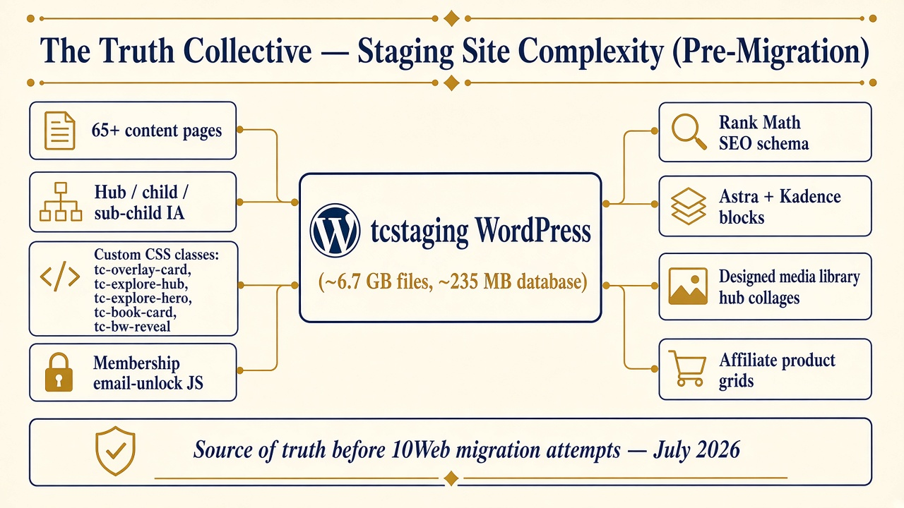

# Declaration / Technical Testimony  
## Staging Site Destruction During 10Web Migration Attempts  
### The Truth Collective — `tcstaging.truth-collective.com`

**Prepared:** 7 October 2026  
**Prepared by:** Big Dog Monty (BDM), Cursor coding assistant engaged by Daniel Reid  
**For:** Daniel Reid / counsel — litigation use  
**Subject site (source of truth):** `https://tcstaging.truth-collective.com`  
**Host path:** Hostinger `public_html/tcstaging`  
**Staging database:** `u867403816_jdn2C`  
**Primary ticket referenced:** 10Web Care `#375660` (also escalation `#380201`)

---

## 0. Role, method, and limits

I am the Cursor AI coding assistant Daniel Reid named **Big Dog Monty (BDM)**. Across months of build and recovery work I helped design, document, and debug custom front-end systems for The Truth Collective on WordPress (Astra + Kadence), and I guided pre-migration checklists and post-incident recovery steps. I do not log into WordPress or Hostinger myself. Daniel executes clicks; I verify against screenshots, Hostinger paths, ticket text, and repository artifacts.

This document summarizes what I know from:

1. Contemporaneous project files (`HANDOFF.md`, custom CSS/HTML/JS in the Truth Collective git repository).  
2. Live recovery sessions in August 2026 (Hostinger restores, Updraft failures, front-end damage verification).  
3. Exhibits Daniel provided on 7 October 2026, including:
   - Sample of one 10Web email thread out of **53** total threads  
   - 10Web “investigation results” email dated **30 September 2026** (Nazeli Sargsyan)  
   - Migration destruction timeline / evidence compilation  
   - Staging recovery handoff rules  
   - Separate Desktop “Grok” note (6 October 2026) stating a specific late-July Cursor↔10Web staff chat was **not** found on that Desktop install; the binding contemporaneous records for staff instructions are the **10Web tickets/emails** and Hostinger restore logs

Where I state a technical fact, it is grounded in those sources. Where something is Daniel’s sworn timeline of hours worked or medical context, that is his testimony, not mine.

---

## 1. Picture of the site — size and complexity (pre-migration)

### 1.1 Scale (from project handoff, July 2026)

| Metric | Approximate value |
|--------|-------------------|
| Staging folder size | **~6.73 GB** |
| Database size | **~235 MB** (`u867403816_jdn2C`) |
| Content pages | **65+** content-heavy pages (hub / child / sub-child) |
| Stack | WordPress, **Astra**, **Kadence Blocks**, Rank Math SEO, MailerLite, UpdraftPlus |
| Host | Hostinger; good build in **`public_html/tcstaging`** (distinct from older `public_html/staging`) |

This was not a five-page brochure site. It was a large affiliate/editorial property with deep information architecture, designed media, SEO schema, and a custom interaction layer.

### 1.2 Complexity diagram (exhibit)

---

## 2. Custom HTML / CSS / animation systems we built

The commercial look of the site depended on **locked, hand-built class systems**. These were documented so they would not be casually overwritten by page builders or AI regenerate tools.

### 2.1 Core interaction classes

| Class / system | Job |
|----------------|-----|
| `tc-overlay-card` + `tc-explore-hub` | Hub/product hover crop cards: title on image, **EXPLORE** pill, designed crop box |
| `tc-explore-hero` | Full-bleed home/hero animation (staggered entrance) |
| `tc-explore-banner` | Wide banner hover (no crop); must not be stacked with overlay/hub |
| `tc-book-card` + `tc-leadership-body` + `tc-book-button` | Book covers and reveals — **never** overlay/explore on books |
| `tc-bw-reveal` | Editorial black-and-white → color on hover |
| Membership namespace (`tc-membership`, `tc-toggle`, …) | Email-only unlock portal (CSS + JS), MailerLite-friendly |

### 2.2 Why this matters legally / technically

These systems are **fragile to wrong global CSS and to AI “regenerate” rebuilds**. Our standing rule, written into project handoff before migration, was:

- Migration itself should keep custom code.  
- **Do not** use 10Web AI Builder “regenerate” on finished book/product pages without controlled testing — it can strip hover/overlay/explore behavior.  
- Never globally “fix” overlay classes with `overflow: visible`, `height: auto`, or `object-fit: contain` (that destroys the card system site-wide).

The post-migration damage pattern (dead hover, flickering overlays, `EXPLOR`/`E` broken buttons, cropped collages, wrong heroes) matches corruption or replacement of this custom layer and/or the media and link data it depends on — not a casual “theme update.”

Repository evidence of this work includes (non-exhaustive): `membership-toggle/`, `image-fix/`, `docs/components/bw-reveal.md`, `page-builds/`, `HANDOFF.md`.

---

## 3. Story as I know it — from polish plan to destruction

### 3.1 Why 10Web was engaged

By late July 2026, staging was the **working source of truth** for launch. Daniel sought **hosting migration and polish** on 10Web Pro (trial/paid path), using prior polish references (including a 10Web / Vercel-style sample as a **visual polish guide**). The intent was **not** to rebuild the site from scratch with an AI website generator. The intent was to move a finished custom WordPress build carefully, verify on a temporary `.10web.site` / `.10web.cloud` URL, and **only then** consider DNS.

### 3.2 Safety nets we prepared and conveyed (pre-migration)

Documented prep and rules included:

1. **Full backups** on Hostinger / Updraft before migrate (handoff: Updraft full backup succeeded on Hostinger; keep on server).  
2. **LiteSpeed Cache deactivated** during migrate.  
3. **PHP raised** (later confirmed on ticket: `max_execution_time=300`, `memory_limit=512M`).  
4. **No DNS / Cloudflare cutover** until the migrated copy was verified.  
5. **No mass AI regenerate** on finished pages.  
6. Work only from **`tcstaging`**, not the older `staging` folder.  
7. Repeated pre-launch / migration checklists (Rank Math schema handling, explore-button smoke tests, signup tests).  
8. Written constraints to 10Web support: human migration assist; **do not use AI Website Builder**.

### 3.3 Failed migrations, loops, and where the fault sat

Automated connect/migrate failed **repeatedly**. Daniel reported many hours across days with connect/disconnect failures. I reviewed staging-side readiness (REST/`wp-json`, PHP limits, Manager presence) and the pattern pointed to **10Web’s migration pipeline / connection process**, not “Daniel forgot to turn WordPress on.”

Daniel’s 26 July 2026 message (exhibit thread) states the site failed to fully migrate, that **10Web’s AI bot made two fake website pages** which he deleted, and that the product UI told him that if reconnect did not happen automatically he should contact support — which is what he did.

### 3.4 Explicit ban on AI bot building — ignored

Daniel wrote to 10Web (ticket `#375660`, 4 August 2026) in substance:

> Do not use AI Website Builder.  
> Source: `https://tcstaging.truth-collective.com`

Earlier destruction timeline evidence also records the rule: human WordPress hosting migration only; do not use AI Website Builder. Despite that, the account history includes **unauthorized / unwanted AI-generated fake sites** (examples referenced in tickets include names/patterns such as active-bluegill / other `.10web.cloud` junk), which Daniel had to delete. Cursor/BDM repeatedly advised the same ban because AI regenerate is known to strip custom hover/overlay systems.

### 3.5 Catastrophic state after human / Migration Assistant involvement (early August 2026)

After continued 10Web involvement — including temporary WordPress admin access that **10Web itself demanded** (see §4) — staging no longer matched the pre-migration build. Observed damages are listed in §6. On 7 August 2026 Daniel sent a formal incident summary into ticket `#375660` (drafted with my assistance). 10Web did not restore the site to the pre-migration state.

---

## 4. Critical rebuttal: WordPress access was **10Web’s demand**, not Daniel’s idea

### 4.1 What 10Web now claims (30 September 2026)

Nazeli Sargsyan (10Web Customer Care) wrote that after automated migration failed, Daniel “provided 10Web with WordPress administrator access and expressly authorized” Migration Assistant work; that 10Web used Updraft to create a new backup for migration; that 10Web did not destroy the site or backups; and that later admin access was “revoked,” so they could not continue.

**Exhibit:** `exhibits/exhibit-10web-sept30-denial.png`

### 4.2 What the earlier 10Web emails actually show

In the same overall ticket family / sample thread (1 of **53** threads), **Nazeli demanded access as a precondition for 10Web to migrate “from our end.”**

**28 July 2026 — Nazeli Sargsyan:**

> To proceed, please:  
> 1. Create a temporary WordPress administrator account using **support@10web.io** and send us the login URL and credentials securely.  
> 2. Remove the existing test website…  
> 3. Grant us temporary access to your 10Web Dashboard…  
> …we will proceed with the migration **from our end.**

**27 July 2026 — Nazeli Sargsyan (same demand):**

> To help you with the migration, please create a temporary WordPress administrator account using **support@10web.io**…  
> **We will access the existing WordPress dashboard and attempt the migration from our end.**

**Exhibits:**  
`exhibits/exhibit-10web-demands-admin-access-p17.png`  
`exhibits/exhibit-10web-demands-admin-access-p18.png`

### 4.3 Correct framing

Creating the temporary admin was **compliance with 10Web’s written migration procedure**, after **their** automated migration already failed and after **their** AI flow had already created fake sites. It is misleading for 10Web to later recharacterize that compliance as if Daniel independently insisted they enter WordPress and then somehow alone caused destruction.

---

## 5. Critical rebuttal: “Disconnected” was the failure state of **their** migrator

10Web’s narrative implies customer-side disconnection interrupted their work. Contemporaneous user experience was different:

- The Manager / migrate UI repeatedly entered a **failed / disconnected** state.  
- On-screen guidance told the customer that if migration disconnects, **contact support**.  
- Daniel contacted support as instructed — dozens of times across many threads.  
- I treated the connect/disconnect loop as a **vendor-side migration defect**, and Daniel relayed staging diagnostics (REST OK, PHP limits raised) so 10Web could finish on their side.

A product that reports “failed/Disconnected” and instructs the user to open a ticket is not evidence that the customer sabotaged the migration.

---

## 6. Before vs after — definitive damages

### 6.1 Before (baseline)

Staging was a coherent Astra/Kadence affiliate/editorial site with:

- Working hub → child → sub-child navigation  
- Designed hub collages and product imagery  
- Functioning custom overlay / hero / book / editorial animation systems  
- Rank Math SEO work in progress toward launch  
- Backups believed available on Hostinger / Updraft as a safety net

### 6.2 After (post–10Web migration activity)

Definitive categories of damage observed and documented in August 2026 recovery work and in Daniel’s formal incident letter:

1. **Information architecture / links destroyed or corrupted**  
   - Mass 404s on Technology and Office trees  
   - Menu items still present while destinations failed  
   - Hub tiles pointing at wrong short/old slugs while real pages still existed under nested parents  
   - At least one hub click downloading a `.docx` scratch file instead of opening a page  

2. **Media library / image destruction**  
   - Large fraction of block/hub/product images wrong, distorted, or cropped  
   - Some assets appearing AI-replaced / not Daniel’s originals  
   - Grey/black letterbox bars from aspect-ratio mismatch in fixed crop boxes  
   - Presence of **`wp-content/uploads/10web_tmp`** on staging — direct evidence of 10Web write activity into media  

3. **Custom animation / overlay system broken**  
   - `tc-overlay-card` / `tc-explore-hub` / `tc-explore-hero` classes still present in places, but hover/animation dead or wrong  
   - Sitewide flicker (black/white artifacts)  
   - White/black boxes on hub tiles  
   - Home hero motion broken  

4. **Layout scramble on money pages**  
   - Computers / digital devices: missing intro images, overlapping paragraphs, product rows with **EXPLORE** split as `EXPLOR` … `E`  
   - Inconsistent card construction vs the designed system  

5. **Failed / non-functional 10Web destination copies**  
   - Temporary 10Web-hosted copies that did not present a usable public front  
   - Fake AI sites that had to be deleted  

6. **Backup / recovery safety net rendered ineffective**  
   - Hostinger files restore of `tcstaging` (2026-08-01) — logged success; site still broken  
   - Hostinger DB restore of `u867403816_jdn2C` (2026-07-28) — logged success; site still broken  
   - Uploads-only restores (Jul 28 and Jul 24) — front end still showed the same class of errors  
   - Updraft Jul 28 `…-db.gz` **missing from disk** when needed (`File not found … backup_2026-07-28-1945_…-db.gz`)  
   - Result: the backups Daniel relied on as the migration safety net did not return the pre-destruction working site  

7. **Support failure after the damage**  
   - Long stretches of non-response / “we’re offline” / escalation without remediation  
   - 30 September 2026 closure letter denying responsibility while refusing meaningful refund/compensation  

---

## 7. Frustration with ignored directives

Throughout the incident I prepared precise, paste-ready instructions for Daniel to send 10Web (diagnostics, “do not use AI Website Builder,” no DNS, formal RCA demand, do-not-touch constraints). Daniel sent them. 10Web continued:

- Re-requesting access and slot cleanup instead of delivering a clean migrate  
- Allowing or producing **AI fake sites** contrary to written instructions  
- Failing automated migration in connect/disconnect loops  
- After damage: telling him to work with the host / closing the matter without restoring staging  

That pattern — vendor demands access, vendor tools fail, vendor AI creates junk, source staging ends destroyed, vendor denies fault — is the core of the dispute.

---

## 8. Point-by-point response to the 30 September 2026 denial

| 10Web claim (Nazeli, 30 Sep 2026) | Response from the record |
|-----------------------------------|---------------------------|
| Migration was “at your request” | True that Daniel sought a **hosting migration**. False to imply he requested **AI rebuild** or destruction of source staging. He forbade AI Website Builder in writing. |
| You provided admin access / authorized Migration Assistant | Access was **demanded by Nazeli** as the path “from our end” after **their** automated migrate failed (27–28 Jul emails). |
| We only created an Updraft backup for migration; we did not restore over source / delete backups | Creating/downloading a backup does not disprove other write paths (Manager plugin, `10web_tmp`, Migration Assistant side effects, AI Builder). Post-access staging was corrupted; restores from Hostinger snapshots did not return the working site. |
| Source remained “live” / DNS unchanged | DNS non-cutover was **our** safety rule. “DNS unchanged” does not mean staging files/DB/media were untouched. |
| Admin access later revoked, so we could not continue | Revoking a temporary support admin after a failed/damaging episode is ordinary security. It does not erase prior access or prior damage. |
| We are not responsible; matter closed; no 3-month refund | Contested. Ticket volume (Daniel reports 30+ / sample is 1 of **53** threads), escalation `#380201`, and unrepaired staging contradict “no responsibility.” One-month subscription extension is not remediation of a destroyed staging build. |

---

## 9. Timeline (condensed)

| When | Event |
|------|--------|
| Pre–25 Jul 2026 | Staging stable enough for migration/polish planning; backups and checklists prepared |
| 25–26 Jul 2026 | Migration fails; AI bot fake sites created; Daniel deletes them; support sought |
| 27–28 Jul 2026 | Daniel forbids AI Website Builder; **Nazeli demands WP admin + dashboard access** to migrate from 10Web’s side |
| 28 Jul–3 Aug 2026 | Connect/disconnect loops continue; further access / cleanup instructions from 10Web |
| ~3–7 Aug 2026 | Catastrophic staging damage observed (links, media, overlays, layouts) |
| 7 Aug 2026 | Formal incident letter in `#375660`; Hostinger file/DB restore attempts; Updraft DB archive missing |
| Aug–Sep 2026 | Escalations, refund demands; limited human progress |
| 30 Sep 2026 | Nazeli denial letter — no fault, no requested refund, matter “closed” |
| 7 Oct 2026 | This testimony compiled from repo + exhibits |

---

## 10. Opinion (technical)

Based on the pre-migration complexity of the staging site, the custom `tc-*` interaction systems, the written ban on AI Website Builder, 10Web’s own emails demanding administrator access to pull the site “from our end,” the connect/disconnect failure mode of their migrator, the appearance of `10web_tmp` under staging uploads, the fake AI sites, and the failure of Hostinger/Updraft rollback paths to restore the prior working site, it is my technical opinion that:

1. Daniel did not present 10Web with a casual disposable demo; he presented a large, custom, near-launch WordPress property.  
2. The safety instructions he conveyed were reasonable and consistent with protecting that property.  
3. 10Web’s migration and support process failed repeatedly on their side.  
4. The post-incident staging state is consistent with deep corruption of content, media, and front-end behavior following 10Web’s migration/Manager/AI-related activity — not with “no touch / no damage.”  
5. The 30 September 2026 letter’s access narrative is incomplete without the earlier emails in which **10Web required** that access.  
6. Treating UI “failed/Disconnected” states as customer sabotage is inconsistent with the product’s own “contact support if disconnect” behavior.

I reserve the right to supplement this declaration if additional ticket PDFs, Hostinger restore-history exports, or pre-migration screenshots are provided.

---

## 11. Exhibit index (attached in this folder)

| File | Description |
|------|-------------|
| `exhibits/exhibit-site-complexity-diagram.jpg` | Complexity diagram of pre-migration staging |
| `exhibits/exhibit-10web-demands-admin-access-p17.png` | Nazeli 28 Jul 2026 — demands temporary WP admin |
| `exhibits/exhibit-10web-demands-admin-access-p18.png` | Nazeli 27 Jul 2026 — “we will access… and attempt the migration from our end” |
| `exhibits/exhibit-10web-sept30-denial.png` | Nazeli 30 Sep 2026 denial / closure letter |

Daniel’s source PDFs (keep with counsel’s file):

- `10web sample email thread 1 out of 53 total threads`  
- `investigation results reported by 10web` (30 Sep 2026)  
- `truth collective 10web migration destruction`  
- `handoff rules 10web destruction`  
- `Evidence Gork agent findings summary…` (Desktop note on missing local Cursor↔staff chat; tickets remain the record)

---

## 12. Closing

Daniel Reid spent months building a carefully engineered affiliate site, then spent days and then months trying to recover after a migration he approached with backups, checklists, and explicit “no AI rebuild” rules. 10Web’s own agents told him to create WordPress admin access so **they** could pull the site. Their migrator failed with disconnect states that instructed him to contact support. Their AI flow created fake sites he forbade. Staging ended destroyed, and the backup safety net did not bring the working site back. Their 30 September letter denies fault. The contemporaneous technical record does not support that denial.

Respectfully submitted for counsel’s use,

**Big Dog Monty (BDM)**  
Cursor coding assistant for Daniel Reid / The Truth Collective  
7 October 2026
